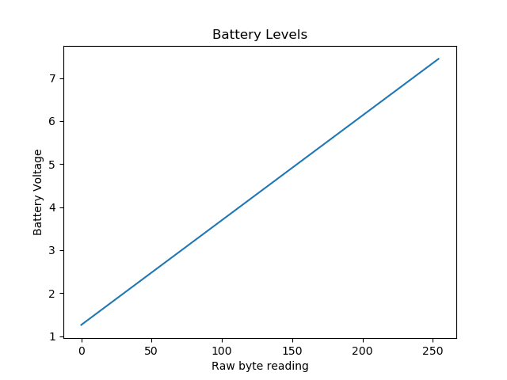

# Introduction

Is byte 3 battery? it seems to change down and appears to be some sort of ADC.

# Raw readings

From another feeder:

A4=164
and reported voltage is 5.254,

From my feeder, measuring the battery voltage:

| Voltage | Reading |
| --------|-------- |
| 5.96v   |   193   |
| 5.85v   |   189   |
| 5.77v   |   187   |
| 5.66v   |   182   |

# Predicting

If we assume a linear path, 

Using this it will be possible to predict the voltage should be at a given reading. 

